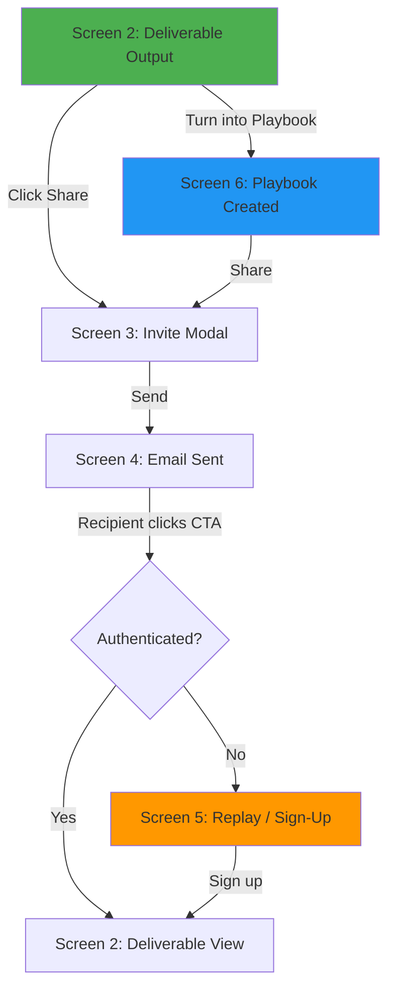

# Skill: UX Flow Builder

> Generates user flow diagrams (Mermaid) from PRD personas and screen specifications. Surfaces dead ends, missing screens, and disconnected flows before design or engineering starts. Helps PMs think in screens, not features.

---

## Trigger

- Automatically during PRD Phase 4 (Personas & Flows) to visualize the user journey
- On-demand when the PM says "show me the flow" or "map the user journey"
- During PRD evaluation to verify screen connectivity

---

## Input

```json
{
  "personas": [
    {
      "name": "string",
      "user_stories": ["string"]
    }
  ],
  "screens": [
    {
      "id": "string (e.g., Screen 1)",
      "name": "string",
      "status": "OPEN | IN_DESIGN | IN_PROGRESS | FULLY_DESIGNED",
      "trigger": "string (what causes this screen to appear)",
      "ctas": [
        {
          "label": "string",
          "destination": "string (screen ID or external)"
        }
      ],
      "variants": ["string (sub-screen names)"]
    }
  ]
}
```

---

## Output

```json
{
  "flow_diagram": "string (Mermaid markdown)",
  "per_persona_flows": [
    {
      "persona": "string",
      "flow_diagram": "string (Mermaid markdown)",
      "screens_visited": ["string (screen IDs in order)"],
      "decision_points": ["string (where the flow branches)"]
    }
  ],
  "issues": [
    {
      "type": "dead_end | orphan_screen | missing_screen | circular_flow | missing_error_path",
      "description": "string",
      "affected_screens": ["string"],
      "recommendation": "string"
    }
  ]
}
```

---

## Behavior

### 1. Parse Screen Connectivity

From the screen specs, build a directed graph:
- Nodes = screens (including sub-variants)
- Edges = CTAs and triggers (what links screen A to screen B)
- Entry points = screens triggered by external events (email CTA, first visit, deep link)

### 2. Generate Per-Persona Flow

For each persona, trace their path through the screens:
- Start from their entry point (existing user → app, new user → email)
- Follow CTAs and triggers through each screen
- Mark decision points (authenticated vs not, empty state vs filled)
- End at their goal state

### 3. Detect Flow Issues

| Issue | Detection | Example |
|-------|-----------|---------|
| **Dead end** | A screen has no outgoing CTA | "Screen 4 (Email) has a CTA to Screen 5, but Screen 5 has no CTA back to the app after auth" |
| **Orphan screen** | A screen has no incoming edge | "Screen 1 (Welcome) is defined but no flow leads to it — is it triggered by first visit?" |
| **Missing screen** | A CTA references a screen that doesn't exist | "Screen 3 CTA says 'triggers email dispatch' but no email screen is defined" |
| **Missing error path** | No screen handles failure states | "What happens if email send fails? No error state defined" |
| **Circular flow** | User can loop infinitely | "Screen 5 → Screen 3 → Screen 5 creates an infinite loop for unauth users" |

### 4. Generate Mermaid Diagram



Rules:
- Max 12 nodes (collapse sub-variants into parent screen unless the branching matters)
- Decision points use diamond shapes
- Color-code by status: green = FULLY DESIGNED, yellow = IN PROGRESS, orange = IN DESIGN, red = OPEN
- Show persona-specific entry points

---

## MCP Server Contract

### Tool: `generate_ux_flow`

```json
{
  "name": "generate_ux_flow",
  "description": "Generate user flow diagrams from PRD personas and screen specs",
  "inputSchema": {
    "type": "object",
    "properties": {
      "prd_content": {
        "type": "string",
        "description": "Full PRD markdown"
      },
      "persona_filter": {
        "type": "string",
        "description": "Optional — generate flow for a specific persona only"
      }
    },
    "required": ["prd_content"]
  }
}
```

---

## CLI Interface

```bash
# Generate flow from PRD
adlc-prd flow --input ./prd.md --output ./flow.mermaid

# Generate flow for a specific persona
adlc-prd flow --input ./prd.md --persona "New User" --output ./new-user-flow.mermaid

# Check for flow issues only
adlc-prd flow-check --input ./prd.md
```

---

## Quality Gates

- [ ] Every screen in the PRD appears in the flow diagram
- [ ] Every CTA in the PRD creates an edge in the diagram
- [ ] Dead ends, orphans, and missing screens are flagged
- [ ] Per-persona flows start from the correct entry point
- [ ] Decision points match the PRD's conditional logic (auth state, user type)
- [ ] Diagram has ≤ 12 nodes (readable)

## Framework Hardening Addendum

- **Contract versioning:** Flow-builder input/output contracts include `contract_version` and semver compatibility checks.
- **Schema validation:** Validate PRD inputs against `docs/schemas/prd-template.schema.json` before generating flow artifacts.
- **Deterministic outputs:** Ensure generated flow artifacts include stable identifiers for reproducibility and diffability.
- **Structured stop reasons:** Emit typed terminal reasons (`missing_screen_graph`, `schema_mismatch`, `unsupported_version`).

